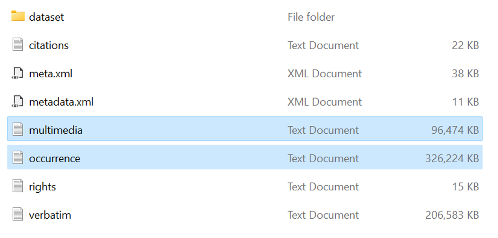
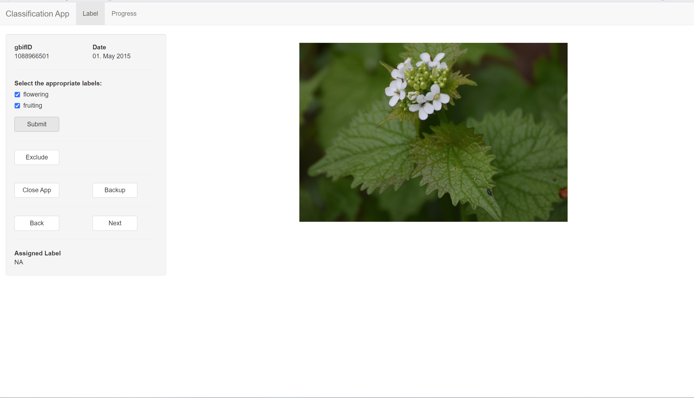
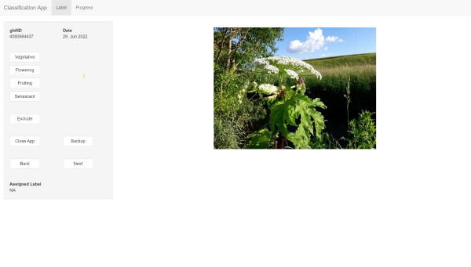

# imgbif

------------------------------------------------------------------------

## About

Pre-process and write images from GBIF multimedia files and classify them manually with a Shiny app.

------------------------------------------------------------------------

## How To...

------------------------------------------------------------------------

### Install

Install the package `devtools` if not already done.

```         
install.packages("devtools")
```

Use `devtools::install_git()` to install the package from the link to the github repository ("https://github.com/brjoey/imgbif.git").

```         
devtools::install_git("https://github.com/brjoey/imgbif.git")
```

### Use

The prerequisite is that you have already downloaded a data set from the [GBIF database](https://www.gbif.org/) directly or with the [rgbif](https://www.gbif.org/tool/81747/rgbif) R package as a Darwin Core Archive.

The folder content of such download from the [GBIF database](https://www.gbif.org/) should look like that:




The relevant text files, namely "multimedia" and "occurrence" are highlighted in blue. This are the files that contain all the necessary information that is needed in the following steps.

#### Pre-process

The `preprocess_multimedia` function can be used to prepare the multimedia file for classification with the classification app. Pre-processing consists of removing occurrences that either do not have a gbifID (occurrence ID) or do not contain a link to an image. In addition, URLs to images in the iNaturalist database are repaired if necessary. Optionally, if the downloaded occurrence file includes publisher information, images from Herbarium databases can be removed. In addition, it is possible to select whether and which image licences are to be removed. Mind that, while observations found in GBIF are usually published under a "CC" licence, this is not necessarily the case for the images contained in the observations. Possible arguments are 'all rights reserved', 'by-sa', 'by-nc', 'NA', and 'unclear'. The Terms of use
of GBIF with regard to Data licensing can be found [here](https://www.gbif.org/terms).


```         
multimedia <- imgbif::preprocess_multimedia(multimedia = path/to/multimedia/file OR data frame,
                                                          occurrence = path/to/occurrence_file,
                                                          herbarium.rm = TRUE,
                                                          license.rm = c("all rights reserved", "unclear")
                                                          )
```

See the help file for more information about `preprocess_multimedia`.

```         
?preprocess_multimedia
```

#### write images

Use `write_identifier` to save images from URLs in the GBIF multimedia file locally. The function uses the `foreach` and `magick` packages to write the images with parallel processing into the destination folder. The images are labelled with the gbifID and if available the label that was assigned when classifying with the classification app.

```         
imgbif::write_identifier(multimedia = "path/to/multimedia/file" OR data frame,
                         destDir = "path/to/destination directory/",
                         format = "png"
                         )
```

See the help file for more information about `write_identifier`.

```         
?write_identifier
```
#### setup the classification app

The app, launched with `imgbif_app`, enables manual classification of images from URLs in a GBIF multimedia file. The argument __"multimedia"__ requires a path to the GBIF multimedia file (with one of the following extensions: "txt", "csv", or "feather") or a `data.frame`/`tibble`.

It is recommended to pre-process the multimedia file using the function `imgbif::preprocess_multimedia`. The pre-processing with `imgbif::preprocess_multimedia` consists of removing occurrences that either do not have a gbifID (occurrence ID) or do not contain a link to an image. In addition, URLs to images in the iNaturalist database are repaired if necessary. Optionally, if the downloaded occurrence file includes publisher information, images from Herbarium databases can be removed. In addition, it is possible to select whether and which licences are to be removed.

The argument "classSize" can be used to define a targeted number of observations per. This can be useful if balanced class sizes are needed for further analysis. By default, the argument __"classSize"__ is set to 100 and accepts any integer __"classSize"__ is then used to show the number of images that where already assigned to each class (label).

__"label"__ takes a `character vector` as an input. This `vector` should include the names of the different classes that will be used to classify the data set. Classes can be assigned as one label per image or as multiple overlapping labels. Based on this 'vector' classes will be used to label the check boxes ("multi_label = TRUE) or action buttons ("multi_label = FALSE") in the Shiny app. It is therefore recommended to use short but precise labels.

It is possible to assign either one label or multiple label to one image, this depends on the argument __"multi_label"__. By default, __"multi_label"__ is set to `FALSE`.

The app writes a file with the name "multimedia.feather" into the __"backupDir"__. This file is always created when a backup is made as well as when the app is closed. The file contains the multimedia file, to which the column "label" has been merged and which contains the assigned label. Regardless of the __"multi_label"__ setting, the assigned label will always be stored as a `character vector` in the respective cell of the "label" column. The backup file has the format feather, which can be read in both R and Python. The feather format is faster in comparison to functions that read or write csv files. It is not recommended to use the feather format for long term storage. Read more about the feather format [here](https://posit.co/blog/feather/). The setup_app function automatically identifies the first unlabeled image (where label == "NA") to resume processing if the app was previously closed. It is required to us the "multimedia.feather" file in order to proceed the labeling process.

The app also writes a backup automatically into the __"backupDir"__. By default every minute. The backup interval can be adjusted (in minutes) with the argument __"backupInterval"__ which takes an `integer` as an input.

```         
imgbif::imgbif_app(multimedia = multimedia,
                  classSize = 100,
                  label = c("flowering", "fruiting"),
                  multi_label = FALSE,
                  backupDir = "path/to/destination directoy",
                  backupInterval = 1
                 )
```

See the help file for more information about `imgbif_app`.

```         
?imgbif_app
```

---

In case of __"multi_label = TRUE"__ the user interface of the app looks like that (with the choice between the labels of __"label"__):




In case of __"multi_label = FALSE"__ the user interface of the app looks like that (with the action buttons labeled according to __"label"__):



***
Rights holder of image in displayed screenhots: Beate & Heinz Beyerlein (CC BY-NC); https://www.inaturalist.org/photos/1790518
***
